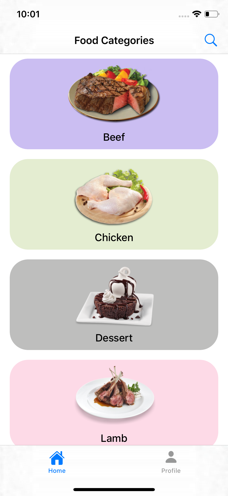
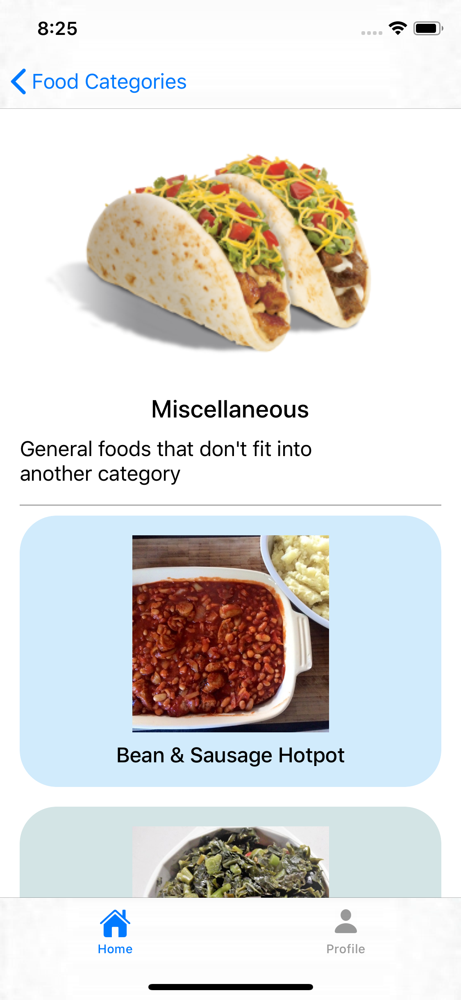
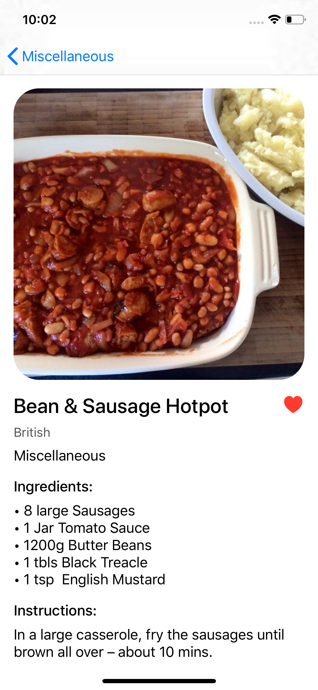
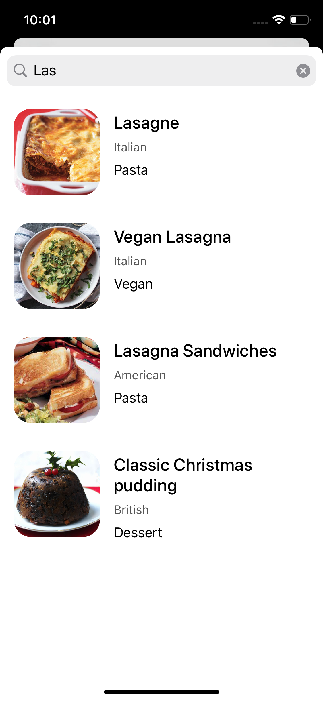
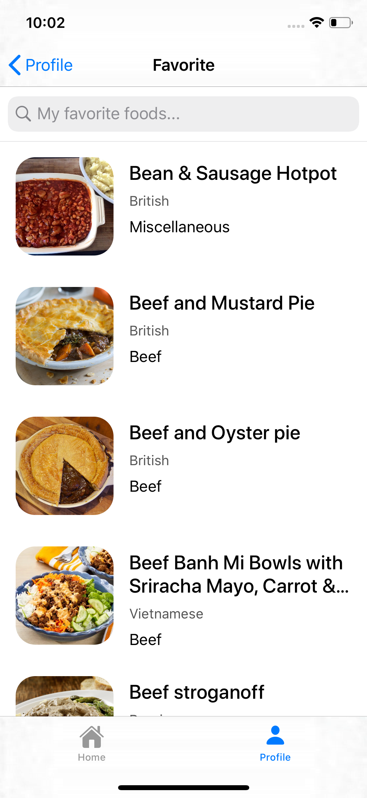

#  Foodify

An iOS foods recipe app from TheMealDB API with **VIPER Clean Architecture**, **Dependency Injection**, **Reactive Programming**, and **Modularization**.

This repository is my class assignment at Dicoding Academy online course platform at class: Become An iOS Developer Expert ([Menjadi iOS Developer Expert](https://www.dicoding.com/academies/209)). I've enrolled in this class as a part of IDCamp 2020 scholarship programme by Indosat Ooredoo and Dicoding Indonesia.

## Screenshots
&nbsp;

## Features
* [x] Fetching foods recipe information online from TheMealDB.com
* [x] Save foods as favorite to see them without internet connection
* [x] Food details
* [x] Search foods online
* [x] Search favorited foods
* [x] Profile
* [x] Trilingual (not including the data from TheMealDB API): English, Indonesian, and Korean

## Technologies Used
- [Swift](https://swift.org/documentation)
- [TheMealDB](https://www.themealdb.com/api.php)
- [Realm](https://github.com/realm/realm-cocoa)
- [Alamofire](https://github.com/Alamofire/Alamofire)
- [SDWebImage](https://github.com/SDWebImage/SDWebImage)

## Author
* **Fahmi Al**
