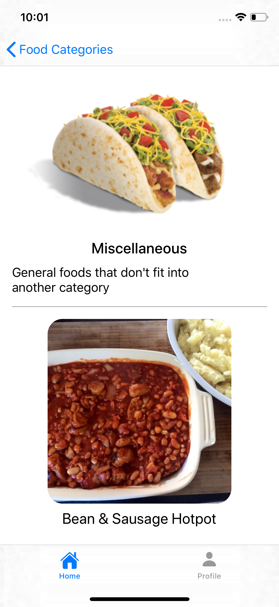

#  Foodify
An iOS foods recipe app from TheMealDB API with VIPER Clean Architecture.

This repository is my class assignment at Dicoding Academy online course platform at class: Become An iOS Developer Expert ([Menjadi iOS Developer Expert](https://www.dicoding.com/academies/209)). I've enrolled in this class as a part of IDCamp 2020 scholarship programme by Indosat Ooredoo and Dicoding Indonesia.

## Screenshots
&nbsp;

## Features
* [x] Fetching food recipe information online from themealdb.com
* [x] Save food as favorite to see it without internet connection
* [x] Food detail
* [x] Search food online
* [x] Search favorited food
* [x] Profile

## Technologies Used
- [Swift](https://swift.org/documentation)
- [TheMealDB](https://www.themealdb.com/api.php)
- [Realm](https://github.com/realm/realm-cocoa)
- [Alamofire](https://github.com/Alamofire/Alamofire)
- [SDWebImage](https://github.com/SDWebImage/SDWebImage)

## Author
* **Fahmi Al**
